### CycleISP: Real Image Restoration via Improved Data Synthesis [CVPR 2020]

---

1. CycleISP 数据生成网络

   **背景：** 在去噪任务上，通常获得不到大量的正式数据来释放 CNN 的真正潜力，大部分要依靠合成数据（普遍假设加性高斯噪声(AWGN)），但是这样训练出来的模型通常在应用于真实相机图像时表现不佳。**AWGN 不足以模拟真实的图像噪声。** 

   **介绍：** 这篇文章提出了一个可以在正反向上对相机成像管道进行建模，可以生成任意数量的逼真图像对，用于在 RAW 和 sRGB 空间中去噪的网络（**该框架将 sRGB 图像转换为 RAW 数据，然后再转换回 sRGB 图像，无需任何相机参数知识**）。

   **贡献：**
      1. 该网络允许我们将图片在 sRGB 和 RAW 空间之间来回移动，而与相机设备无关。
      2. 可以生成更加符合真实情况的图像噪声合成器，用于在 RAW 和 sRGB 空间中生成成对的配对数据。
      3. 双重注意机制的使用。
      4. 可以用于 RAW 和 sRGB 图像中去除噪声。
      5. **超越了去噪任务， 可用于比如立体电影中的色彩匹配。**

2. 简单介绍：
   
   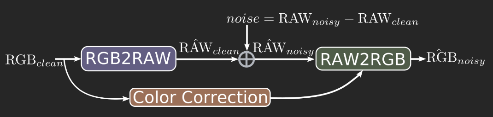

   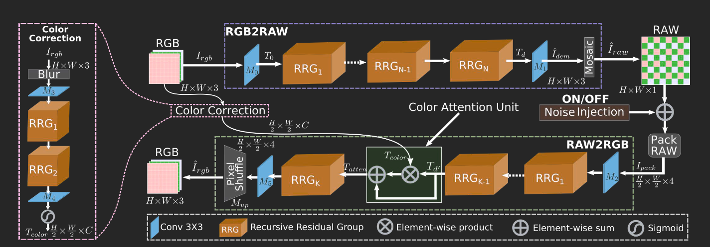

   1. RGB2RAW
   
      1. 大致表示：
      
         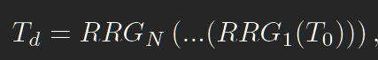
      
         实际上还要使用最终的卷积块 M1 来进行处理最后结果，为了保留尽量多原始图像的结构信息，所以最后的输出的大小仍为 H\*W\*3。
      
      2. 损失设计：
      
            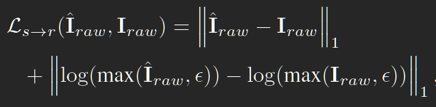

            那个希腊字母是数值稳定性的小常数，**添加了对数损失来强制所有图像值进行近似相等的处理。**

   2. RAW2RGB
      
      1. 噪声注入模块关闭，大致表示
         
         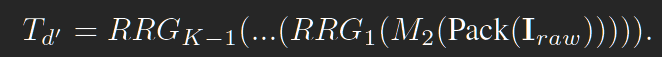   
         
         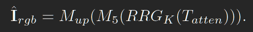

      2. **颜色注意单元**

         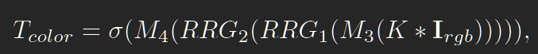
      
         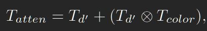
      
         其中 \* 表示卷积，K 是标准偏差经验设置为 12 的高斯核。这种**强模糊操作**确保只有颜色信息流经这个分支，而结构内容和精细纹理来自主要的RAW2RGB网络。
      
      3. 损失表示
   
         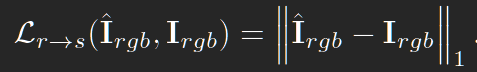
      
   3. RRG：如图，CA 和 SA 组成的 DAB 模块，每个 RRG 模块有多个 DAB， 输出残差连接。
      
      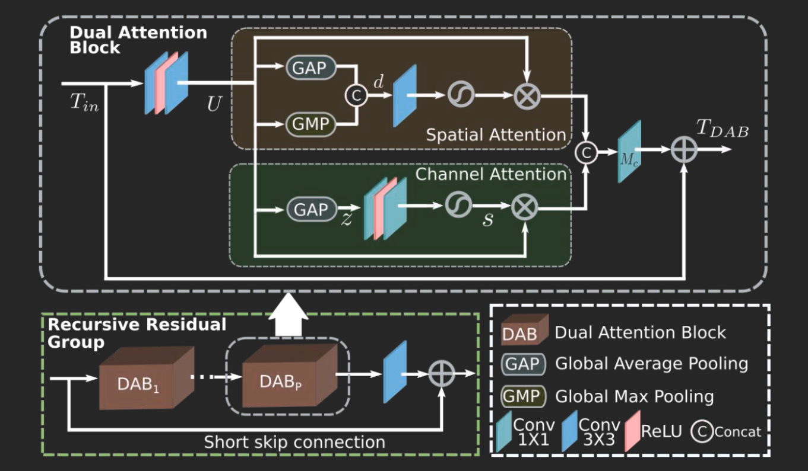
   
   4. 联合微调

      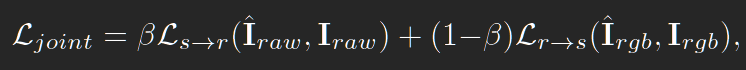
   
3. 去噪

   1. 生成数据：这部分其实没必要写

      1. 生成去噪用成对 RAW 图像
      
         噪声注入模块开启！

      2. 生成去噪用成对 sRGB 图像

         将带有噪声的 RAW 图像输入得到带有噪声的 RGB 图像。

         提高图像对的质量：加入随机噪声的噪声注入模块被替换为（仅用于微调）逐像素噪声残留。

   2. 去噪网络：
      
      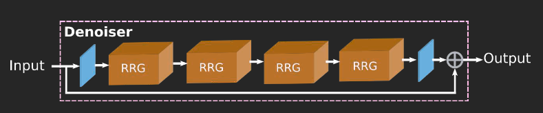

      就到这里吧。
   
完
      
