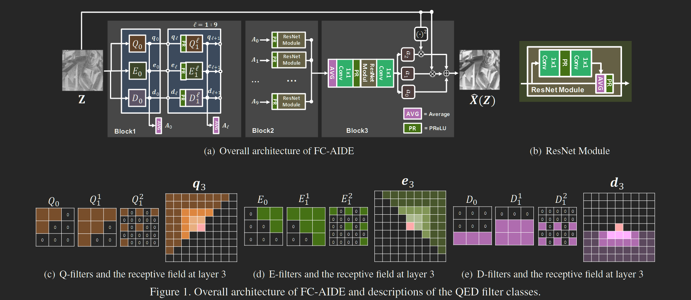
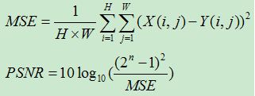

### Fully Convolutional Pixel Adaptive Image Denoiser [ICCV 2019]

---

1. **全卷积自适应图像去噪器（FC-AIDE）**

   **显著扩展了 2018 年提出的 [Neural AIDE (N-AIDE)](https://ieeexplore.ieee.org/stamp/stamp.jsp?tp=&arnumber=8462618) 的框架。**

   **创新点：**
   1. 实现了一种新颖的全卷积结构。
   2. 为自适应微调引入正则化方法。

   **效果：** 在所有基准数据集上都优于最近的基于 CNN 的最先进的降噪器，并且在各种具有挑战性的场景中变得特别强大，例如图像/噪声特征不匹配或监督训练数据稀少。

   **在此之前的 SOTA：** 之后再说，等以后有需求，按照该论文的说法，最优是基于 CNN 的方法。

2. **大致思路：**

   基于 CNN 的方法背后的主要思想是将去噪视为一个有监督的回归问题，不需要对底层干净图像进行任何复杂的先验，并让 CNN 找出从大量训练数据中学习正确映射的方法。

   当时使用 residual learning、skipconnections 和 densely connected structure 的基于 CNN 的降噪器的几种变体已经取得了令人印象深刻的最先进性能。

   论文中提到，**以上思路的 SOTA 方法完全基于 CNN 的离线批量训练，因此对给定的噪声图像缺乏自适应去噪**，通常训练数据和给定的噪声图像之间存在各种不匹配（图像失配或者噪声失配）会严重降低基于 CNN 的方法在多种实际场景中的去噪性能，这个缺点虽然可以尝试构建具有多种噪声和图像特征的复合训练集来部分解决，进行盲训练，但是局限性也很明显，因为构建的数据集不可能含有所有变化。

   **FC-AIDE：基于 CNN 离线监督训练，但是根据每个给定噪声图像自适应微调去噪器。**
   1. 基于 N-AIDE 将降噪器确定为基于上下文的逐像素映射，使用 MSE 估计损失。然后，使用设计的估计损失，来对网络进行微调。
   2. 不同于原始 N-AIDE 的简单全连接结构，设计了新的全卷积架构。且除了 MSE，进一步考虑了二次映射。
   3. **引入两种正则化方法（数据增强和 ℓ2SP (Starting Point) 正则化）。虽然这些技术在一般监督学习设置中是众所周知的，但论文中利用它们使得微调模型不会过度拟合估计的损失并很好地泛化到 MSE。**

3. **网络结构：** 确实是很有意思的结构

---

**PSNR：** 峰值信噪比，经常用作图像压缩等领域中信号重建质量的测量方法。单位 dB。PSNR 值越大，说明重建图像失真越小。

